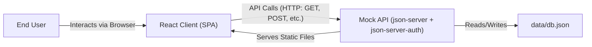

# CodeBook Application Architecture

This document outlines the architecture of the CodeBook application, including its structure, components, and data flow.

## 1. System Architecture

CodeBook follows a **Client-Server architecture**, albeit with a mocked backend for development and demonstration purposes.

- **Client (Frontend):** A Single Page Application (SPA) built using **React**. It handles the user interface, interactions, routing, and state management. It's bootstrapped using Create React App.
- **Server (Mock Backend):** A **`json-server`** instance enhanced with `json-server-auth`. It simulates a RESTful API based on the `data/db.json` file, providing endpoints for CRUD operations on products, users, and orders, and handling basic JWT authentication.



_(In the Docker production setup, `json-server` also serves the static React build files)_

## 2. Project Folder Structure

The project is structured following typical React conventions, enhanced by Create React App and organized for clarity:

```
kartikey-codebook/
├── Dockerfile           # Docker configuration for containerization
├── package.json         # Project dependencies and scripts
├── tailwind.config.js   # Tailwind CSS configuration
├── data/                # Mock backend data and routes
│   ├── db.json          # Main database file for json-server
│   └── routes.json      # Custom route definitions for json-server
├── public/              # Static assets and HTML template
│   ├── index.html       # Main HTML entry point
│   ├── manifest.json    # PWA manifest
│   ├── robots.txt       # Instructions for web crawlers
│   └── assets/          # Static assets like images (served directly)
│       └── images/
├── src/                 # Main application source code
│   ├── App.css          # Root App component styles (minimal)
│   ├── App.js           # Root React component, sets up layout (Header/Footer) and routing
│   ├── index.css        # Global styles, Tailwind imports, font imports
│   ├── index.js         # Application entry point, renders App, sets up Router and Context Providers
│   ├── assets/          # Assets imported and bundled by Webpack (e.g., Logo)
│   ├── components/      # Reusable UI components, often presentation-focused
│   │   ├── Elements/    # Smaller, atomic components (ProductCard, Rating, Dropdowns)
│   │   ├── Layouts/     # Structural components (Header, Footer)
│   │   ├── Other/       # Utility components (ScrollToTop)
│   │   └── Sections/    # Larger UI sections (Search bar)
│   ├── context/         # React Context API setup (Cart, Filter)
│   ├── hooks/           # Custom React Hooks (useTitle)
│   ├── pages/           # Page-level components, container components for routes
│   │   ├── Home/        # Components specific to the Home page
│   │   ├── Products/    # Components specific to the Products List page
│   │   ├── Cart/        # Components specific to the Cart page
│   │   ├── Order/       # Components specific to the Order Summary page
│   │   ├── Dashboard/   # Components specific to the User Dashboard page
│   │   └── ...          # Login.js, Register.js, ProductDetail.js, PageNotFound.js
│   ├── reducers/        # Reducer functions for useReducer hooks (Cart, Filter state logic)
│   ├── routes/          # Routing configuration (AllRoutes, ProtectedRoute)
│   └── services/        # API interaction logic (auth, data fetching, product fetching)
```

## 3. Major Components

- **`App.js`**: The root component, renders the `Header`, `Footer`, and `AllRoutes`.
- **Layouts (`Header.js`, `Footer.js`)**: Define the main layout structure present on all pages. The Header includes navigation, search toggle, cart link, theme toggle, and user dropdown.
- **Routing (`AllRoutes.js`, `ProtectedRoute.js`)**: Defines application routes using `react-router-dom`. `ProtectedRoute` guards routes requiring authentication.
- **Pages (`HomePage.js`, `ProductsList.js`, `ProductDetail.js`, `CartPage.js`, etc.)**: Represent distinct views/pages of the application. They often fetch data and orchestrate smaller components.
- **Context Providers (`CartProvider.js`, `FilterProvider.js`)**: Wrap the application to provide global state (cart, filters) and dispatch functions.
- **Reducers (`cartReducers.js`, `filterReducers.js`)**: Contain the pure functions that define how state changes based on dispatched actions for Cart and Filter contexts.
- **Services (`authService.js`, `dataService.js`, `productService.js`)**: Encapsulate logic for interacting with the mock API (fetching data, sending data, handling authentication).
- **Reusable UI Components (`ProductCard.js`, `Rating.js`, `DropdownLoggedIn.js`, `FilterBar.js`, etc.)**: Smaller, focused components used across different pages.

## 4. Data Flow

Data flow in CodeBook primarily follows a unidirectional pattern typical of React applications, often mediated by Context and Services.

**Example: Adding an Item to Cart**

1.  **User Interaction:** User clicks the "Add To Cart" button on a `ProductCard` component.
2.  **Event Handler:** The `onClick` handler in `ProductCard.js` is triggered.
3.  **Context Action:** It calls the `addToCart(product)` function obtained from the `useCart()` hook (which comes from `CartContext`).
4.  **Dispatch:** Inside `CartContext.js`, the `addToCart` function prepares the updated `cartList` and `total`, then calls `dispatch` with an action type (`ADD_TO_CART`) and the payload (updated list and total).
5.  **Reducer:** The `cartReducer` (`src/reducers/cartReducers.js`) receives the action, processes it based on the `type`, and returns the new state object `{ cartList: [...], total: ... }`.
6.  **State Update:** React updates the state within `CartContext`.
7.  **Re-render:** Components consuming `CartContext` (like `Header` for the cart count, `ProductCard` to update the button state, `CartPage` if open) re-render with the new state.

**Example: Fetching Products**

1.  **Page Load:** The `ProductsList.js` component mounts.
2.  **Effect Hook:** An `useEffect` hook runs to fetch product data.
3.  **Service Call:** It calls `getProductList(searchTerm)` from `productService.js`.
4.  **API Request:** `productService.js` makes an asynchronous `fetch` request to the `json-server` API endpoint (e.g., `/444/products?name_like=...`).
5.  **API Response:** `json-server` processes the request and returns the product data (or an error).
6.  **Service Response:** The `fetch` call resolves, and `productService.js` returns the data (or throws an error).
7.  **Context Update:** Back in `ProductsList.js`, the fetched data is passed to `initialProductList(data)` obtained from `useFilter()`. This dispatches an action (`PRODUCT_LIST`) to the `filterReducer`.
8.  **Reducer & State:** The `filterReducer` updates the `productList` in the `FilterContext` state.
9.  **Re-render:** `ProductsList.js` re-renders, accessing the updated `products` list from `useFilter()` and displaying the `ProductCard` components. Filter/Sort logic within `FilterContext` is applied automatically before the list is provided to the component.

## 5. Design Decisions

- **State Management (Context API + useReducer):** Chosen for managing global state (cart, filters) due to its built-in nature in React, avoiding the need for external libraries like Redux for this scale of application. `useReducer` helps manage more complex state transitions predictably.
- **Mock Backend (`json-server`):** Used to decouple frontend development from backend development and provide a quick way to simulate a realistic API. Ideal for prototyping and demos.
- **Styling (Tailwind CSS):** A utility-first CSS framework was chosen for rapid UI development, maintainability, and easy customization without writing extensive custom CSS. Dark mode is implemented using Tailwind's `dark:` variant.
- **Service Layer:** API interaction logic is abstracted into service functions (`src/services/`) to keep components cleaner and improve code organization and reusability.
- **Atomic Design Influence:** The `src/components/` directory is structured with `Elements`, `Layouts`, and `Sections`, hinting at principles similar to Atomic Design for building reusable UI parts.
- **Custom Hooks (`useTitle`):** Used to encapsulate reusable logic (like updating the document title based on the current page).
- **Session Storage for Token:** `sessionStorage` is used to store the authentication token, meaning the user stays logged in for the duration of the browser session but will need to log in again if the browser/tab is closed. `localStorage` could have been used for longer persistence.
- **Environment Variables (`REACT_APP_`):** Used for configuration like API host (`REACT_APP_HOST`) and guest credentials (`REACT_APP_GUEST_LOGIN`, `REACT_APP_GUEST_PASSWORD`), allowing easy changes between development and build environments. The empty `REACT_APP_HOST` in the Docker build ensures relative API paths are used when served by `json-server` in the container.

---
